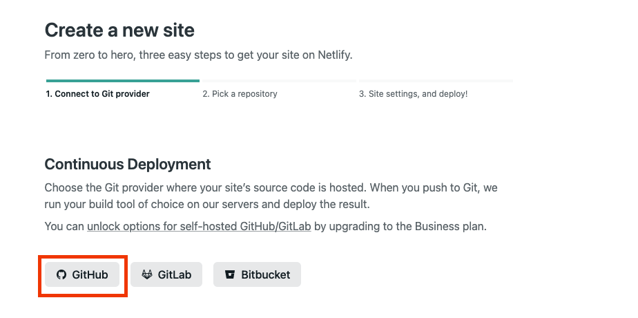
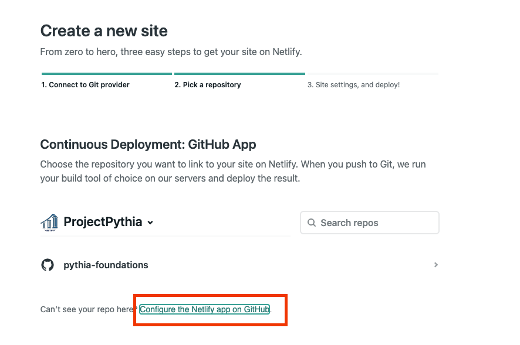
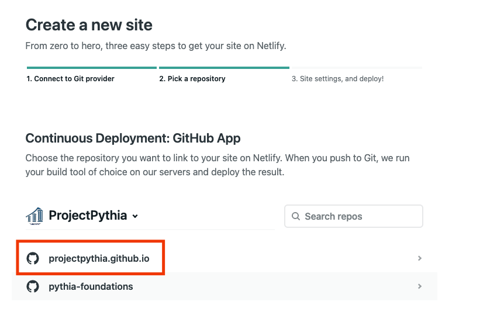
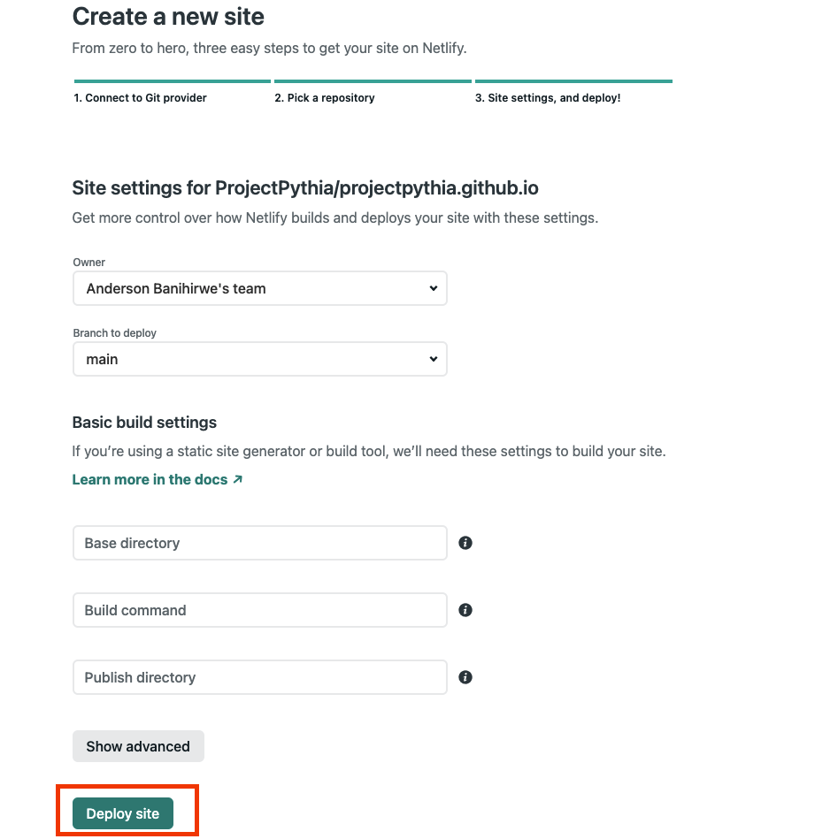
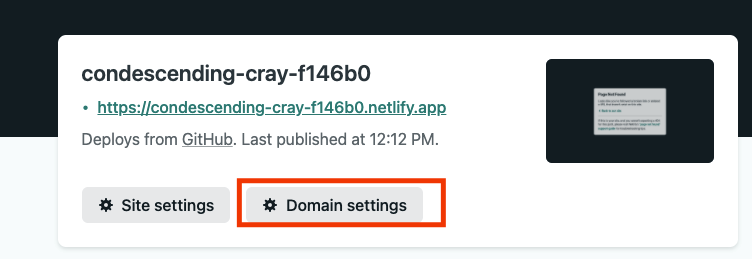
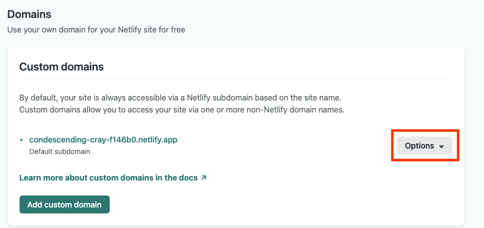
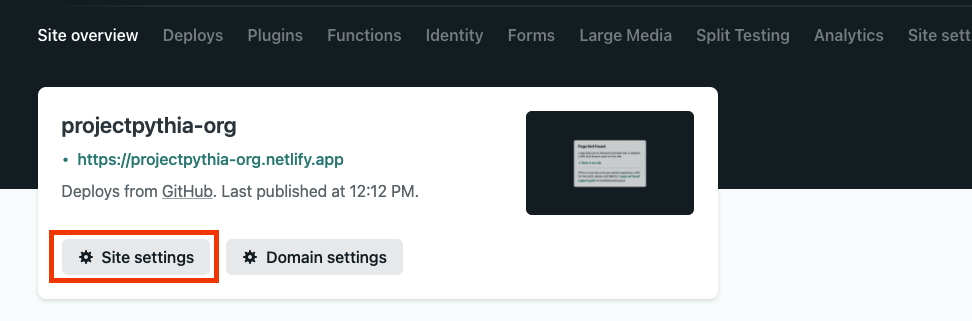
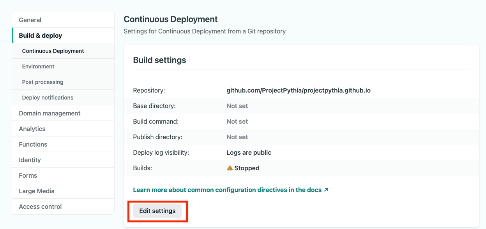
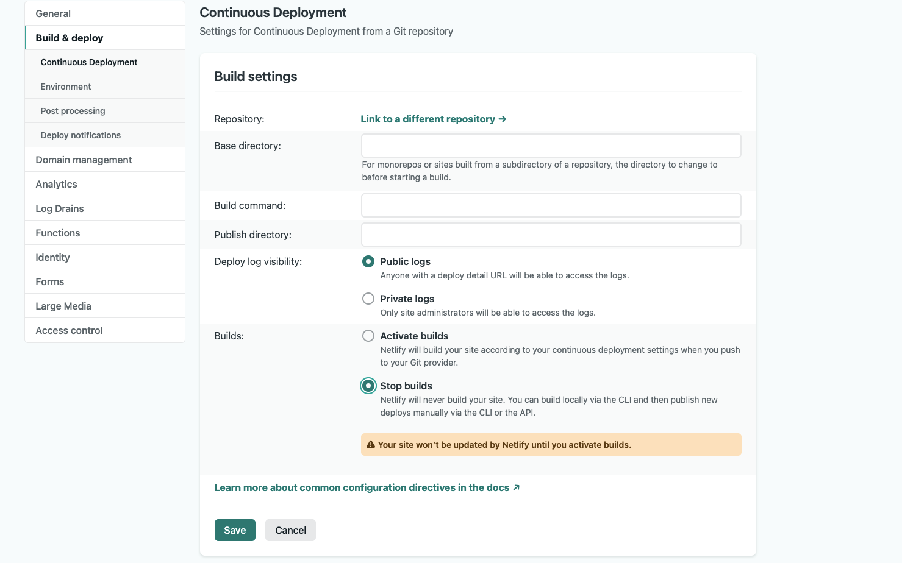
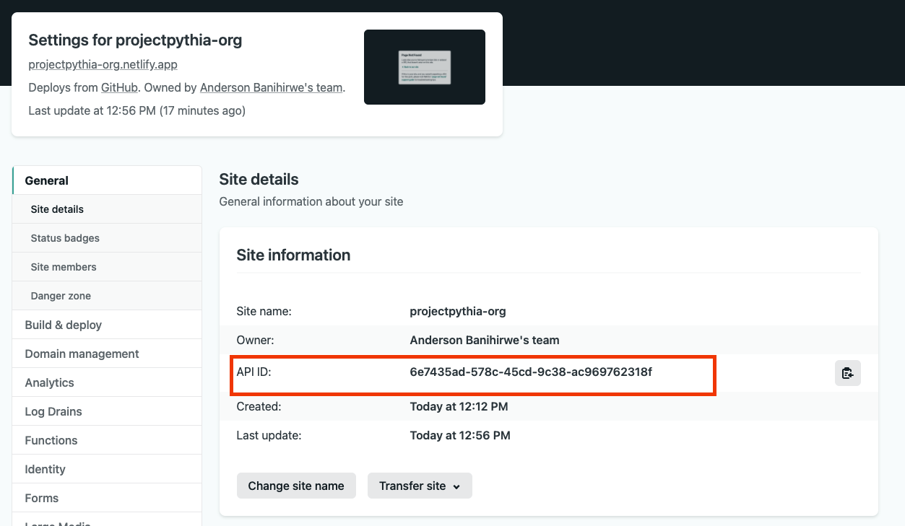

# Automatic build previews with GitHub Actions and Netlify

This document is an attempt at documenting the process of automating the build previews with GitHub Actions and Netlify.

The following instructions assume that you already have an account with [Netlify](https://app.netlify.com/signup).


## Step 1: Connect your GitHub repository to Netlify

Once you've logged in to Netlify, you can connect your GitHub repository to your site by heading over to [https://app.netlify.com/start](https://app.netlify.com/start) and choosing your Git provider. For our use case, we'll be using GitHub.



After selecting GitHub, you'll see a new page with the GitHub organizations/accounts connected to your Netlify account. To select a repository, ensure that you've connected the right organization. Netlify will then show you the repositories that you can connect to your site. If not, click on the `configure the Netlify app...` option and follow the prompts.





---

## Step 2: Update domain settings

Once you've deployed the site, Netlify will assign it a random domain name. You can use the domain settings to change the domain name to something more meaningful.




We'll be using the  `projectpythia-org.netlify.app` domain.

---

## Step 3: Update site settings

Netlify will automatically try to build and deploy your site when you push to the GitHub repository. We are going to disable this behavior because we will be using GitHub Actions to build the site ourselves.






---


## Step 4: Configure GitHub Actions

Whenever a pull request or a push event is triggered on our GitHub repository, we'll build the site using GitHub Actions. Once the site's HTML pages are built, we send them to Netlify for deployment. Netlify will then deploy the site to the domain we specified and we'll be able to preview the site.


### Building the site

We're going to create a GitHub workflow for building and deploying the site. The configurations for this workflow are saved in `.github/workflows/ci.yaml`:

<details>
<summary>
GitHub workflow configuration:
</summary>

```yaml
name: deploy-site

# Only run this when the master branch changes
on:
  push:
  pull_request:
  workflow_dispatch:
jobs:
  build:
    runs-on: ubuntu-latest
    defaults:
      run:
        shell: bash -l {0}
    if: github.repository == 'ProjectPythia/projectpythia.github.io'
    steps:
      - name: Cancel previous runs
        uses: styfle/cancel-workflow-action@0.9.1
        with:
          access_token: ${{ github.token }}
      - uses: actions/checkout@v2
      - uses: conda-incubator/setup-miniconda@master
        with:
          channels: conda-forge
          channel-priority: strict
          activate-environment: pythia-site-dev
          auto-update-conda: false
          python-version: 3.8
          environment-file: environment.yml
          mamba-version: '*'
          use-mamba: true

      # Build the site
      - name: Build the site
        run: |
          make html

      - name: Zip the site
        run: |
          set -x
          set -e

          if [ -f site.zip ]; then
              rm -rf site.zip
          fi
          zip -r site.zip ./_build/html

      - uses: actions/upload-artifact@v2
        with:
          name: site-zip
          path: ./site.zip
      # Push the site's HTML to github-pages
      - name: Deploy to GitHub pages
        if: github.ref == 'refs/heads/main'
        uses: peaceiris/actions-gh-pages@v3.8.0
        with:
          github_token: ${{ secrets.GITHUB_TOKEN }}
          publish_dir: ./_build/html
          enable_jekyll: false
          cname: projectpythia.org
```
</details>


### Previewing the built site

To preview the built site, we'll be using GitHub Actions to interact with Netlify API so as to retrieve the site's URL and posts this URL as a comment on the pull request. GitHub workflow for building and deploying the site. This workflow is saved in `.github/workflows/preview.yaml`:

<details>
<summary>
GitHub workflow configuration:
</summary>

```yaml
name: preview-site
on:
  workflow_run:
    workflows:
      - deploy-site
    types:
      - requested
      - completed
jobs:
  deploy:
    if: github.repository == 'ProjectPythia/projectpythia.github.io'
    runs-on: ubuntu-latest
    defaults:
      run:
        shell: bash
    steps:
      - uses: actions/checkout@v2
      - name: Set message value
        run: |
          echo "comment_message=This pull request is being automatically built with [GitHub Actions](https://github.com/features/actions) and [Netlify](https://www.netlify.com/). To see the status of your deployment, click below." >> $GITHUB_ENV
      - name: Find Pull Request
        uses: actions/github-script@v4
        id: find-pull-request
        with:
          script: |
            let pullRequestNumber = ''
            let pullRequestHeadSHA = ''
            core.info('Finding pull request...')

            const pullRequests = await github.pulls.list({owner: context.repo.owner, repo: context.repo.repo})
            for (let pullRequest of pullRequests.data) {
              if(pullRequest.head.sha === context.payload.workflow_run.head_commit.id) {
                  pullRequestHeadSHA = pullRequest.head.sha
                  pullRequestNumber = pullRequest.number
                  break
              }
            }
            core.setOutput('number', pullRequestNumber)
            core.setOutput('sha', pullRequestHeadSHA)
            if(pullRequestNumber === '') {
              core.info(
                 `No pull request associated with git commit SHA: ${context.payload.workflow_run.head_commit.id}`
              )
            }
            else{
              core.info(`Found pull request ${pullRequestNumber}, with head sha: ${pullRequestHeadSHA}`)
            }

      - name: Find Comment
        uses: peter-evans/find-comment@v1
        if: steps.find-pull-request.outputs.number != ''
        id: fc
        with:
          issue-number: '${{ steps.find-pull-request.outputs.number }}'
          comment-author: 'github-actions[bot]'
          body-includes: '${{ env.comment_message }}'

      - name: Create comment
        if: |
          github.event.workflow_run.conclusion != 'success'
          && steps.find-pull-request.outputs.number != ''
          && steps.fc.outputs.comment-id == ''
        uses: peter-evans/create-or-update-comment@v1
        with:
          issue-number: ${{ steps.find-pull-request.outputs.number }}
          body: |
            ${{ env.comment_message }}
            🚧 Deployment in progress for git commit SHA: ${{ steps.find-pull-request.outputs.sha }}

      - name: Update comment
        if: |
          github.event.workflow_run.conclusion != 'success'
          && steps.find-pull-request.outputs.number != ''
          && steps.fc.outputs.comment-id != ''
        uses: peter-evans/create-or-update-comment@v1
        with:
          comment-id: ${{ steps.fc.outputs.comment-id }}
          edit-mode: replace
          body: |
            ${{ env.comment_message }}
            🚧 Deployment in progress for git commit SHA: ${{ steps.find-pull-request.outputs.sha }}

      - name: Download Artifact site
        uses: dawidd6/action-download-artifact@v2.14.1
        with:
          github_token: ${{ secrets.GITHUB_TOKEN }}
          workflow: ci.yaml
          run_id: ${{ github.event.workflow_run.id }}
          name: site-zip

      - name: Unzip site
        run: |
          rm -rf ./_build/html
          unzip site.zip
          rm -f site.zip

      # Push the site's HTML to Netlify and get the preview URL
      - name: Deploy to Netlify
        id: netlify
        uses: nwtgck/actions-netlify@v1.2
        with:
          publish-dir: ./_build/html
          production-deploy: false
          github-token: ${{ secrets.GITHUB_TOKEN }}
          enable-commit-comment: false
        env:
          NETLIFY_AUTH_TOKEN: ${{ secrets.NETLIFY_AUTH_TOKEN }}
          NETLIFY_SITE_ID: ${{ secrets.NETLIFY_SITE_ID }}
        timeout-minutes: 5

      - name: Update site Preview comment
        if: |
          github.event.workflow_run.conclusion == 'success'
          && steps.find-pull-request.outputs.number != ''
          && steps.fc.outputs.comment-id != ''
        uses: peter-evans/create-or-update-comment@v1
        with:
          comment-id: ${{ steps.fc.outputs.comment-id }}
          edit-mode: replace
          body: |
            ${{ env.comment_message }}

            🔍 Git commit SHA:  ${{ steps.find-pull-request.outputs.sha }}
            ✅ Deployment Preview URL: ${{ steps.netlify.outputs.deploy-url }}
```
</details>


## Step 5: Generate Personal Access Token

To interact with Netlify API from GitHub Actions we need to generate a personal access token. To generate a personal access token, head over to [https://app.netlify.com/user/applications#personal-access-tokens](https://app.netlify.com/user/applications#personal-access-tokens) and click on the `New access token` button. Save this token to somewhere safe.

---

## Step 6: Create GitHub Action secrets

Head over to the repository secrets page on GitHub: `https://github.com/ORG/REPOSITORY/settings/secrets/actions` and set the following secrets:

- `NETFLIFY_AUTH_TOKEN`: The personal access token generated in Step 5.
- `NETLIFY_SITE_ID`: The site ID generated in Step 2. This ID can be found on the site's settings page (this is the same thing as the `API ID` in the Netlify site settings).

