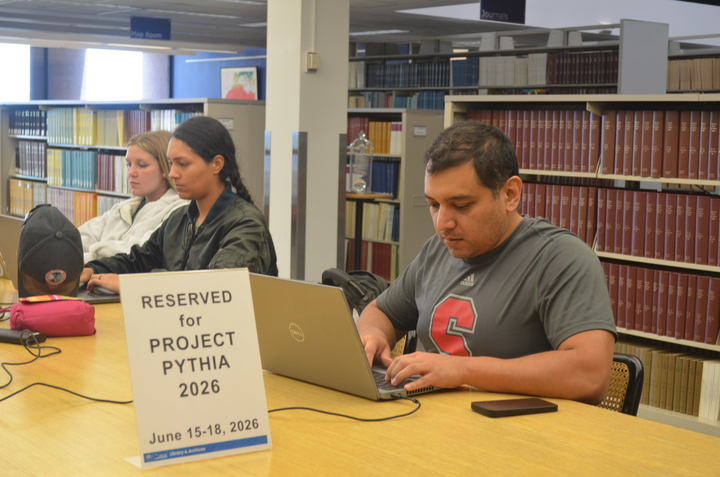
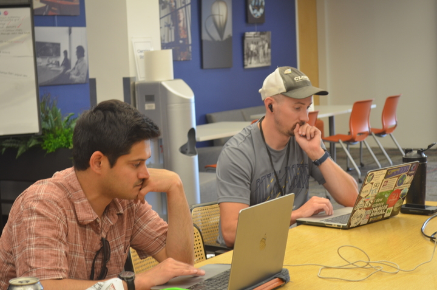
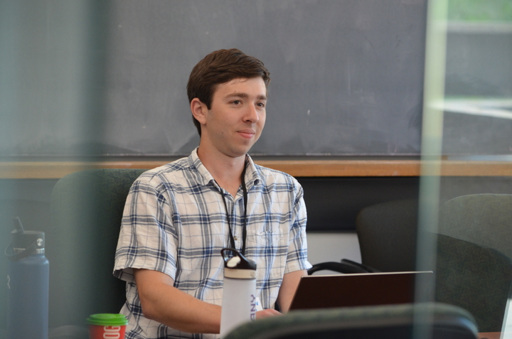
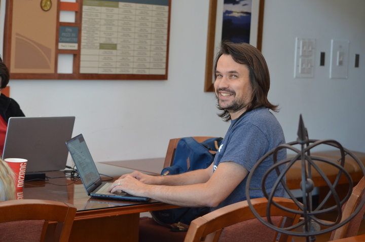
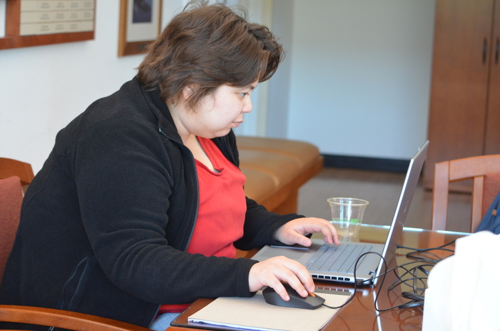
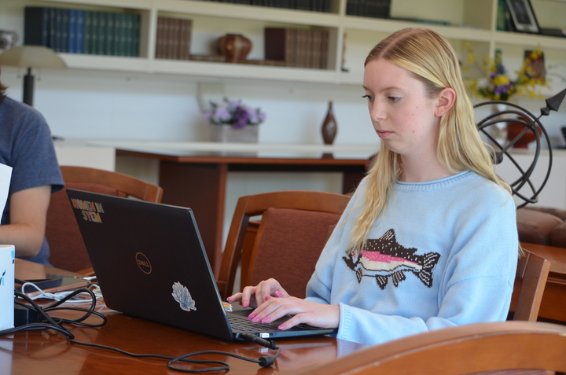
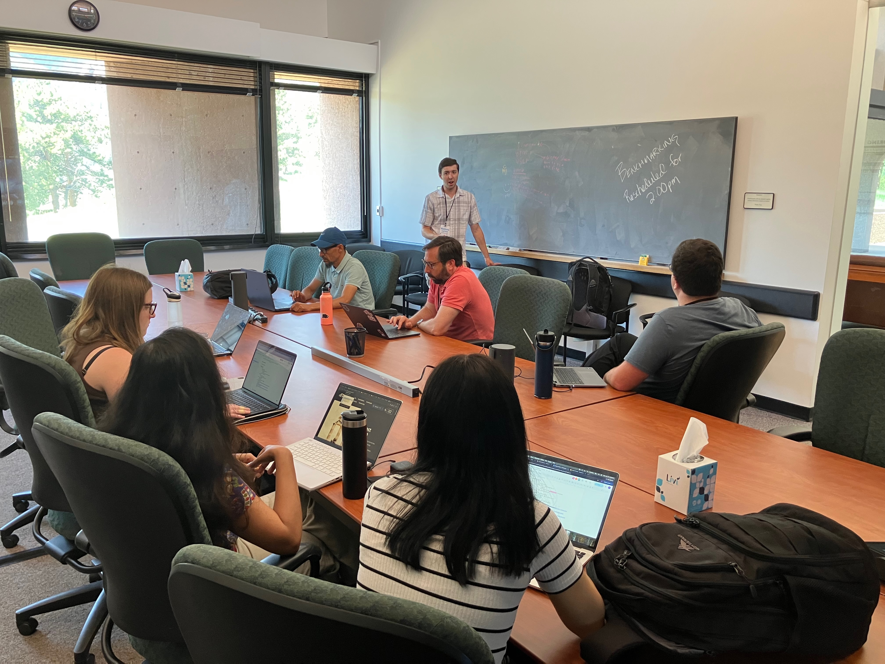
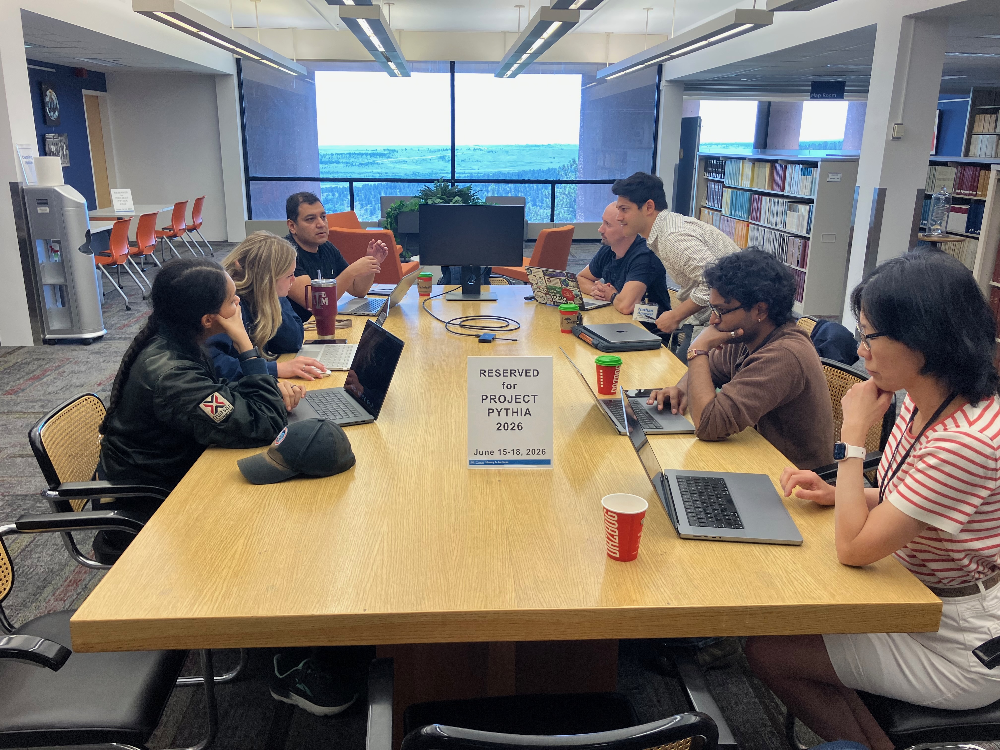
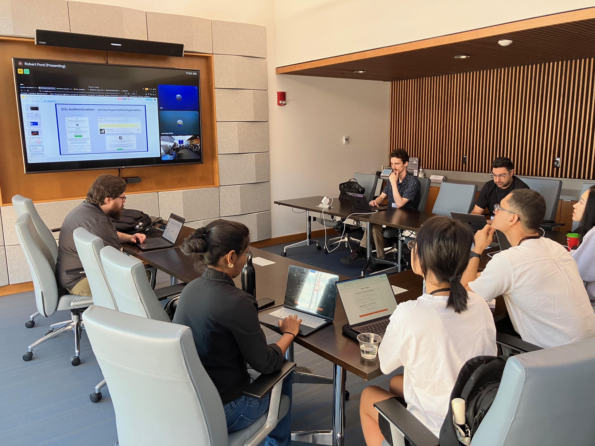

## Another Pythia hackathon: cooked, served, and shared

For the past several years, Project Pythia has been hosting annual "Cook-off" hackathon events at the [NSF NCAR Mesa Lab](https://scied.ucar.edu/visit) in Boulder, CO, with funding from the National Science Foundation {cite:p}`https://doi.org/10.5281/zenodo.8184298`.

The [Pythia Cook-off 2026](https://projectpythia.org/pythia-cookoff-2026/) was held June 15-18 as a 100% in-person event. We just wrapped a great week of Cookbook hacking with a great group of open geoscience enthusiasts:

```{figure} images/cookoff2026-group.jpg
:alt: Pythia Cook-off 2026 group photo on the steps in the Mesa Lab atrium

Photo credit: Samantha Scalice (with [Juan Diego Mantilla](https://github.com/jdmantillaq)'s nice camera!)
```

## More cooks, more Cookbooks

### Community growth

One of the main goals of the Pythia Cook-off is to disseminate skills and enthusiasm for open knowledge-sharing in the space of computational geoscience workflows. This year, we welcomed about 50 participants with a good mix of science backgrounds, career stages, and prior hacking experience.

There are now 153 total members of the [ProjectPythia GitHub organization](https://github.com/orgs/ProjectPythia/people), many of whom have participated in one or more of our hackathons over the past few years.


:::::{figure}
:alt: Photos of breakout groups at work

::::{grid} 3 3 3 3
:::{grid-item}

:::
:::{grid-item}

:::
:::{grid-item}

:::
:::{grid-item}

:::
:::{grid-item}

:::
:::{grid-item}

:::
::::

Photo credits: Juan Diego Mantilla
:::::


### Expanding the Cookbook gallery

The other main goal of our Cook-offs is to build cool and useful new content for the [Pythia Cookbook Gallery](https://cookbooks.projectpythia.org).

Each year we welcome proposals for new Cookbooks. People bring ideas (and often some prexisting code) from their own work, and pitch their Cookbook projects to the whole community. Breakout groups are formed under the guidance of the individual topic leaders.

This year we had eight breakout groups including seven Cookbook-focussed groups:

- [Meteorological feature tracking](https://github.com/ProjectPythia/feature-tracking-cookbook) with group leader [Matthew Lynne](https://github.com/mattsl21)
- [Aerosol cloud interaction](https://github.com/ProjectPythia/Aerosol-Cloud-Interactions-cookbook) with group leader [Weiyi Wang](https://github.com/wwy8828)
- [Geomorphology](https://github.com/ProjectPythia/geomorphology-cookbook) with group leader [Thomas Guilment](https://github.com/tguilment)
- [Cloud-based METAR observations archive](https://github.com/ProjectPythia/METAR_archive-cookbook) with group leader [Kevin Tyle](https://github.com/ktyle)
- [MPAS viewer](https://github.com/ProjectPythia/mpasviewer-cookbook) with group leader [Jorge Bravo](https://github.com/jhbravo)
- [Spectral analysis for geophysical date](https://github.com/ProjectPythia/spectral-analysis-cookbook) with group leader [Juan Diego Mantilla](https://github.com/jdmantillaq)
- [NSF NCAR's Geoscience Data Exchange (GDEX)](https://github.com/ProjectPythia/gdex-cookbook) with group leader [Harsha Hampapura](https://github.com/hrhampapura)
- Pythia core infrastructure with group leader [Chris Holdgraf](https://github.com/choldgraf) — see [Chris's blog post](gallery-listing.md)

:::::{figure}
:alt: Photos of breakout groups at work

::::{grid} 3 3 3 3
:::{grid-item}

:::

:::{grid-item}

:::

:::{grid-item}

:::
::::

Breakout groups hard at work! Photo credits: John Clyne.
:::::

About half of our group leaders are returning Cook-off participants, while the other half are brand-new contributors to Project Pythia! We are grateful to the whole group for bringing so many ideas, enthusiasm, and leadership to their groups.

Leaders will be working remotely with their groups over the coming weeks to put some finishing touches on their Cookbook projects before they appear in the [gallery](https://cookbooks.projectpythia.org). Watch this space!

## Challenges and solutions

### Infrastructure

We want to get our heterogenous breakout groups up and running on Cookbook development as quickly as possible on day 1 of the event, with a minimum of configuration. A cloud-based JupyterHub provisioned by our partners at [2i2c](https://2i2c.org) meant not losing any time to managing Python environments or struggling with data access on individual laptops. You can [find our hub configuration here](https://github.com/2i2c-org/infrastructure/blob/189e605be1251d95e8280c64750c873a0f55489c/config/clusters/projectpythia/common.values.yaml).

Because every Cookbook defines a bespoke computational environment with a unique set of packages and dependencies, we could not use a single shared environment for every group. Instead, 2i2c configured the Pythia hub to use [JupyterHub Fancy Profiles](https://2i2c.org/jupyterhub-fancy-profiles/) with on-demand user image building enabled (based on [repo2docker](https://repo2docker.readthedocs.io/en/latest/)). This allowed each breakout group to build and deploy their own unique hub environment. Groups could then tailor their environment to the needs of their Cookbook but still work in a common shared space.

Special thanks and gratitude go to [Angus Hollands](https://2i2c.org/author/angus-hollands/) for working through some day 1 technical glitches in real time from a very different timezone!

### Breakout group logistics

Breakout groups benefit from two different types of leadership: the _disciplinary knowledge_, vision, and mentorship skills necessary to organize the team and formulate good content, and technical navigation through the challenges of git, GitHub, and the Cookbook infrastructure.

Building off our experience and feedback from previous events, this year we tried to keep a clear separation between these two roles, and embed a dedicated technical facilitator within each group.

:::{figure} ./images/hacker7.jpeg

Group collaboration with embedded technical support. Photo credit: John Clyne.
:::

The qualitative impression of the hackathon organizers is that this arrangement worked pretty well. Most groups were able to stay focussed on content creation for a good fraction of the week. Some survey comments bear this out:

> The organizers were very prepared and the event ran smoothly. We could focus predominantly on hacking and spent little energy on spin-up.

> I liked the amount of support and guidance from the main team. I found it very helpful. I also liked all the opportunities to get to know others.

> Mainly, I appreciated the organization and the level of teamwork among the breakout groups.

> I especially appreciated the "live tech support."

> From my perspective, getting a bunch of strangers to be able to work together in a short period of time is miraculous and arguably, one of the key benefits of this hackathon.

### Thanks to our tech helpers!

A huge thanks to our volunteer team of technical facilitators:
- Robert Ford
- Ana Espinoza
- Drew Camron
- Hasnat Aslam
- Daniel Howard
- James Munroe
- Orhan Eroglu
- Rudy Klucik
- Brian Rose


## Cook-off 2026 by the numbers

- Registered participants: 49
- Travel awards: 27
- First timers: 34
- Breakout groups: 8
- Technical facilitators: 11
- Total commits to repositories in the [ProjectPythia GitHub organization](https://github.com/ProjectPythia): 842
- Fraction of surveyed participants who indicated they would "definitely" or "probably" participate in a similar event in the future: 90%

## The Albany gang

Finally, a special shout-out to the gang from the University at Albany's [Department of Atmospheric & Environmental Sciences](https://www.albany.edu/daes) who were well-represented at this year's Cook-off!

```{figure} images/Pythia-2026-UAlbany.jpeg
:alt: Pythia Cook-off 2026 participants from the University at Albany in front of the Mesa Lab main entrance

Cook-off 2026 participants from [UAlbany DAES](https://www.albany.edu/daes). From left to right: Kevin Tyle, Juan Diego Mantilla, Kathryn Rooney, Bella Condo, Brian Rose, Robert Ford, Matthew Lynne, Alex Blackmer, Jacob Vile.
```

UAlbany is a lead partner with NSF NCAR on Project Pythia. This year we had a record-breaking nine participants travel from Albany to Boulder for the event, including three breakout group leaders and two technical facilitators. Go [Great Danes](https://en.wikipedia.org/wiki/Albany_Great_Danes)!
