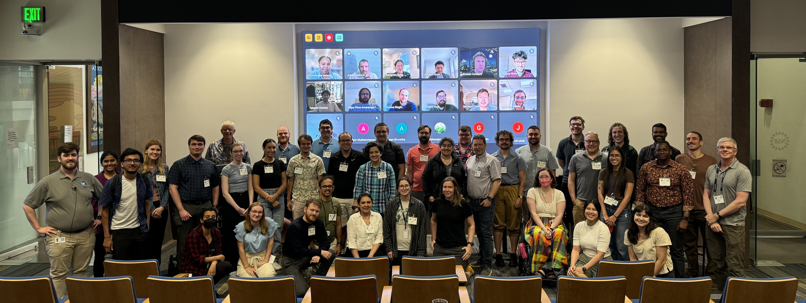
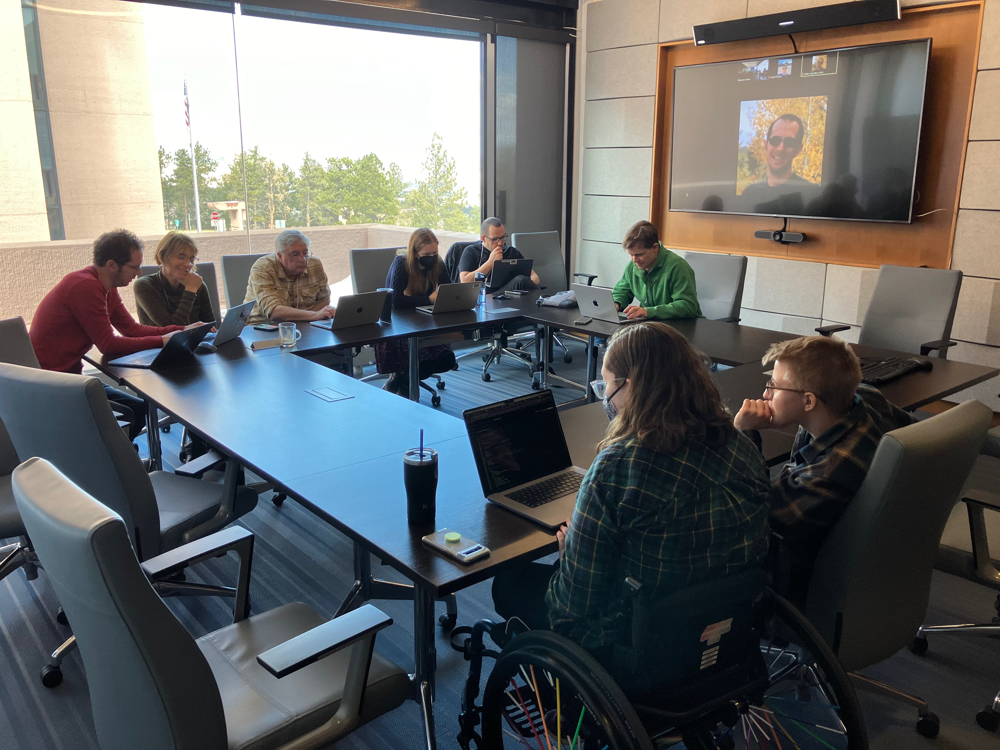
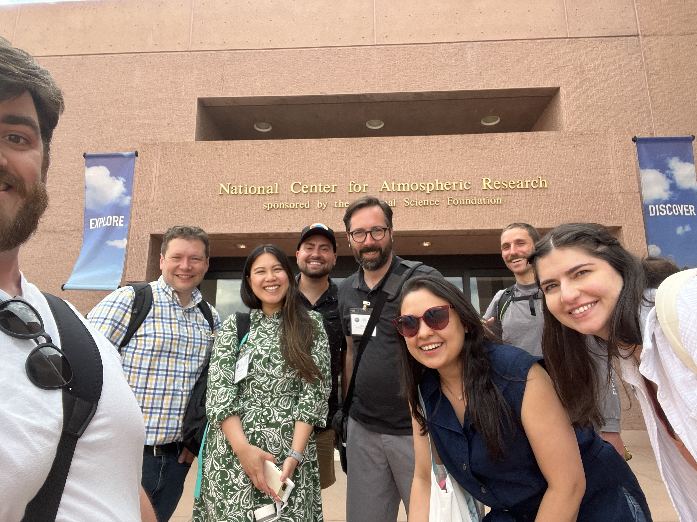
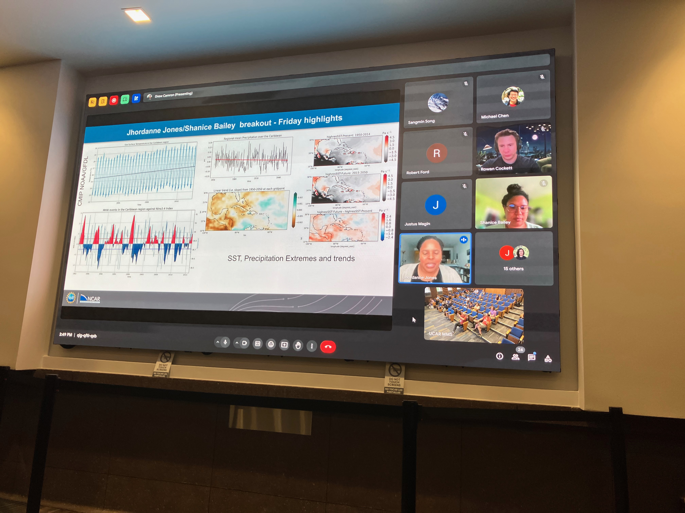

# Hello world, new Cookbooks!

The Project Pythia team is excited to announce the publication of new community-contributed Cookbooks from our successful [2024 Pythia Cook-Off hackathon](https://projectpythia.org/pythia-cookoff-2024/), which was held June 11 - 14 2024, at the NSF NCAR's Mesa Lab in Boulder, Colorado and online.

[Cookbooks](https://cookbooks.projectpythia.org) are geoscience-flavored collections of tutorials, recipes, and reproducible example workflows for Python-based data analysis and visualization. Cookbooks are supported by a rich computational infrastructure enabling collaborative authoring, automated health-checking, and interactive use. Cookbooks undergo a review process, are citable by DOI, and are tested and maintained by the Project Pythia community.

It's time to celebrate the Cook-off projects that have made it across the finish line. _[Watch this space!](https://cookbooks.projectpythia.org)_ There are several more exciting Cookbooks still in development.

## Cookbook round-up

Here you can find brief descriptions and links to the new (and significantly updated) books on the [Pythia Cookbook Gallery](https://cookbooks.projectpythia.org). Try also filtering the [gallery](https://cookbooks.projectpythia.org) with the new "events" dropdown menu!

### [EOFs Cookbook](https://projectpythia.org/eofs-cookbook/)

**Authors:** [Robert Ford](https://github.com/r-ford)

<doi:10.5281/zenodo.10909812>

This Cookbook covers Empirical Orthogonal Function (EOF) analysis and its application to climate data. EOF analysis is an essential tool for studying the variability of the atmosphere-ocean system. Meteorological and oceanographic data is noisy and multidimensional, but an EOF analysis allows us to pull out patterns from the data that might otherwise be difficult to find. The goal of this cookbook is to provide background and context to the analysis alongside practical examples of carrying out the analysis using Python packages.

**Contributors:**

### [Ocean Biogeochemistry Cookbook](https://projectpythia.org/ocean-bgc-cookbook/)

**Authors:** [Lev Romashkov](https://github.com/rmshkv) and [Kristen Krumhardt](https://github.com/kristenkrumhardt)

<doi:10.5281/zenodo.12557198>

This Cookbook covers working with various sources of ocean biogeochemistry data, including Community Earth System Model (CESM) output and observational data. It provides a brief introduction to some metrics important to ocean biogeochemistry, from physical quantities like temperature to biological quantities like plankton biomass. It also demonstrates some of the data science techniques used to work with this information, and provides an introduction to the relationship between modeled and observational estimates.

**Contributors:**

### [Investigating interhemispheric precipitation changes over the past millennium](https://projectpythia.org/paleoPCA-cookbook/)

**Authors:** [Deborah Khider](https://github.com/khider), [Hari Sundar](https://github.com/sriharisundar), and [Varun Ratnakar](https://github.com/varunratnakar)

<doi:10.5281/zenodo.11659789>

This Cookbook covers paleoclimate model-data comparison using spatio-temporal pattern obtained using Principal Component Analysis (PCA).

Paleoclimate observations obtained from tree rings or the geochemical composition of speleothems, ice and sediments provide an out-of-sample validation of climate models. However, comparing the output of climate models directly with the paleoclimate observations is difficult: (1) they are often expressed in different quantities (i.e., temperature vs ring width), (2) paleoclimate observations have large time uncertainties, (3) paleoclimate observations often incorporate more than one environmental signal (i.e., temperature AND moisture).

Recently, [Steinman et al. (2022)](https://doi.org/10.1073/pnas.2120015119) used PCA analysis to compare model and data output. Here, we use a similar approach with the [CESM Last Millennium simulation](https://www.cesm.ucar.edu/community-projects/lme) and proxy records stored on the [LiPDverse](https://lipdverse.org). This repository contains paleoclimate datasets that have been curated by the community and are archived in a standard format, facilitating analysis.

**Contributors:**

### [ESGF Cookbook](https://projectpythia.org/esgf-cookbook/)

**Authors:** [Max Grover](@mgrover1), [Nathan Collier](@nocollier), [Carsten Ehbrecht](@cehbrecht), [Jacqueline Nugent](@jacnugent), and [Gerardo Rivera Tello](@griverat)

<doi:10.5281/zenodo.11663067>

This Cookbook covers how to access and analyze datasets that can be accessed from Earth System Grid Federation (ESGF) cyberinfrastructure.

This cookbook focuses on highlighting analysis recipes, as well as data acccess methods, all accesible within the Python programming language. This cookbook also spans beyond the scope of a single Climate Model Intercomparison Project (ex. CMIP6), expanding to other experiments/datasets such as CMIP5 and obs4MIPs.

**Contributors:**

### [Radar Cookbook](https://projectpythia.org/radar-cookbook/)

**Authors:** [Max Grover](https://github.com/mgrover1), [Zachary Sherman](https://github.com/zssherman), [Milind Sharma](https://github.com/gewitterblitz), [Alfonso Ladino](https://github.com/aladinor), [Crystal Camron](https://github.com/crystalclearwx), and [Takashi Unuma](https://github.com/TakashiUNUMA)

<doi:10.5281/zenodo.8075854>

Pythia's very first cookbook continues to grow!

This cookbook provides the essential materials to learning how to work with weather radar data using Python. Most of the curriculum is focused around the Python ARM Toolkit. Once you go through this material, you will have the skills to read in radar data, apply data corrections, and visualize your data, building off of the core foundational Python material covered in the Foundations Book

The Example Workflows section contains a growing collection of real-world case studies.

**Contributors:**

### [ARCO ERA-5 Interactive Visualization Cookbook](https://projectpythia.org/ERA5_interactive-cookbook/)

**Authors:** [Kevin Tyle](https://github.com/ktyle), [Michael Barletta](https://github.com/Michael-Barletta), [Negin Sobhani](https://github.com/negin513), [Nicholas Cote](https://github.com/ncote) , [Harsha Hampapura](https://github.com/hrhampapura) , and [Philip Chmielowiec](https://github.com/philip2c)

<doi:10.5281/zenodo.10303236>

This Cookbook covers accessing, regridding, and visualizing the [ECMWF Reanalysis version 5](https://www.ecmwf.int/en/forecasts/dataset/ecmwf-reanalysis-v5) (aka **ERA-5**) dataset in a [Analysis Ready, Cloud Optimized](https://www.frontiersin.org/articles/10.3389/fclim.2021.782909/full) (aka **ARCO**) format.

The ERA-5 represents the current state-of-the-art meteorological reanalysis, extending from well back into the 20th century to the present. While the data is freely-available for download by archival centers such as [Copernicus](https://www.copernicus.eu/en) and [RDA](https://rda.ucar.edu/), the data format and directory structure are typically not well-suited for interactive exploration. Specifically, parameters of interest are stored in individual files, for a limited period of time.

A team at Google Cloud and Research has made interactive exploration much more tenable by representing the data in [Zarr](https://zarr.readthedocs.io/en/stable/) format.

This Cookbook demonstrates how to do the following:

1. Access parameters of interest from the Zarr store on Google Cloud
2. Regrid from model native (Gaussian) to lat-lon (Cartesian) coordinates
3. Plot a map at a specific time using Matplotlib and Cartopy
4. Create interactive visualizations, leveraging the [Holoviz](https://holoviz.org) ecosystem

**Contributors:**

### [Wavelet Cookbook](https://projectpythia.org/wavelet-cookbook/)

**Authors:** [Cora Schneck](https://github.com/cyschneck)

<doi:10.5281/zenodo.14550038>

This Cookbook covers how to work with wavelets in Python. Wavelets are a powerful tool to analyze time-series data. When data frequencies vary over time, wavelets can be applied to analysis trends and overcome the time/frequency limitations of Fourier Transforms

**Contributors:**

## The 2024 Cook-off

### In pictures

 

### By the numbers

- Number of attendees: 92 (49 in-person, 43 remote)
- Number of attendees receiving travel support from Project Pythia: 16
- Career stage:
  - 14% undergrad
  - 29% graduate
  - 14% postdoc
  - 43% faculty or staff
- Gender of attendees:
  - 59% men
  - 30% women
  - 11% other
- Number of individual project breakout groups: 9
- New cookbooks published to the [Pythia Gallery](https://cookbooks.projectpythia.org): 5 _(as of this writing)_
- Heavily revised cookbooks: 2

## Want to get involved?

<a role="button" class="btn btn-light btn-lg" style="display: flex; align-items: center; font-weight: 600; text-decoration: none; ">
          SAVE THE DATE! Project Pythia is hosting our next Cookbook Cook-off hackathon event at the NSF NCAR's Mesa Lab, August 5-8 2025.
  </a>

Do you have some feedback or ideaa for a new Cookbook project? Unsure how to get started? We'd love to hear from you at any of our [open meetings](https://projectpythia.org/#monthly-pythia-meetings), through the [Pangeo Discourse](https://discourse.pangeo.io/c/education/project-pythia/), or via any of our social media. Join us at our next Cook-off 2025!

Take a look at our [guide for Cookbook contributors](https://projectpythia.org/cookbook-guide.html).
